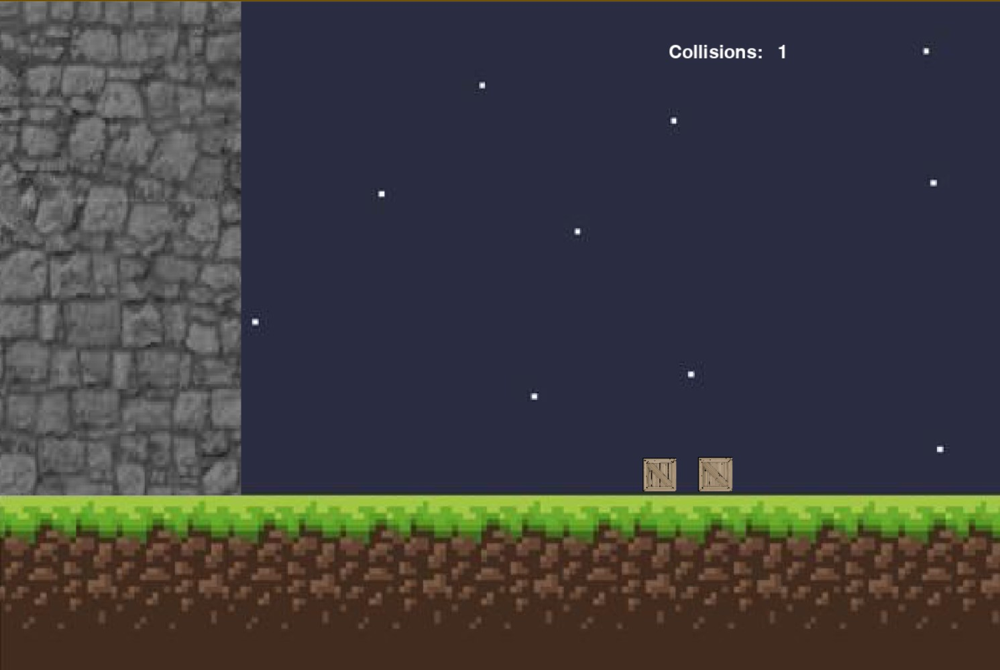

# Block and Wall Collisions

A Python/pygame physics simulation of two blocks colliding with each other and a wall — with a surprising appearance of the digits of π.



## What it does

This program simulates two blocks on a frictionless surface next to a wall of infinite mass and zero velocity. You input the mass and velocity of each block, and the simulation plays out every elastic collision, counting them as they happen.

The fun part: when the first block starts at rest with a mass of 1 kg and the second block has a mass of 100^n kg (1, 100, 10000, …), the total collision count spells out the digits of pi — 3, 31, 314, 3141, …

## How to run it

Requires Python 3 and pygame.

```bash
pip install -r requirements.txt
python main.py
```

Enter the mass and velocity for each block when prompted, then watch the collisions — and the counter — play out.

## How it works

- Elastic-collision physics between the two blocks and the wall
- Real-time collision counter
- Adjustable masses and velocities, so any configuration can be explored — not just the pi-digit cases

## Known limitations

At large scales (masses above ~10,000) the simulation becomes inconsistent and the collision counts are usually incorrect — collision-tolerance tweaks were tried but didn't resolve it. Because the simulation is GUI-driven, some argument combinations are impossible to execute. Fixing the numerical stability at scale would be the natural next step.

## License

Released into the public domain under the Unlicense — see [LICENSE](LICENSE).
